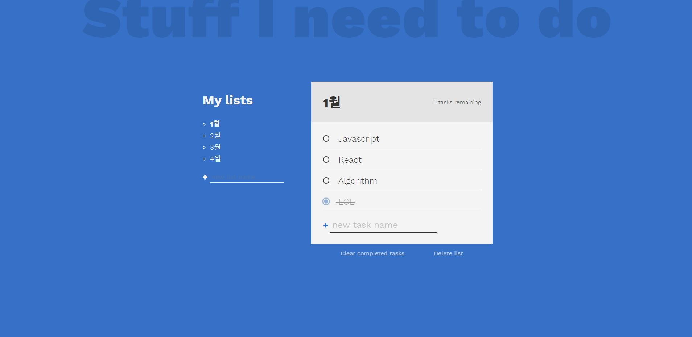

## Javascript-Todo-List

#### [video tutorial](https://www.youtube.com/watch?v=W7FaYfuwu70)

HTML, CSS 작업이 끝난 상태의 todo list에 Javascript를 이용한 기능추가 실습

### 느낀점

`localstorage`를 통해 데이터를 하드코딩하지 않아 새로고침을 해도 데이터를 유지할 수 있다는 것을 새롭게 알았다.

`vanilla javascript`를 연습하기 위해서 한 실습이였는데 잘 골랐던 것 같다. (`document.querySelector`의 반복 사용)

`container` 구조를 이해할 수 있었고, 각 element의 `EventListener`를 반복해서 만들면서 효율적으로 만드는 방법을 조금이나마 배울 수 있었다.
